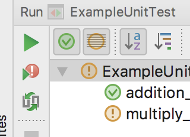

# Rerun Failed Tests fail

Re-running tests from the button at the bottom fails.

## How to reproduce
- Run unit tests from the nav bar
- Re-run test from the button below.



- Error message says

```
0 test classes found in package 'com.tomoima.testapplication'

Process finished with exit code 254
Empty test suite.
```

and can not run failed tests.
 